<p align="center">
  
</p>

<h1 align="center">codediag</h1>

<p align="center">
  <strong>Diagnose your code before you ship.</strong><br>
  <sub>One command. Five analyzers. One score.</sub>
</p>

<p align="center">
  <a href="https://www.npmjs.com/package/@sabahattink/codediag"></a>
  <a href="https://www.npmjs.com/package/@sabahattink/codediag"></a>
  <a href="https://github.com/sabahattink/codediag/actions"></a>
  <a href="https://github.com/sabahattink/codediag/blob/main/LICENSE"></a>
</p>

<br>

<p align="center">
  
</p>

<br>

## Install

```bash
npx @sabahattink/codediag scan .
```

That's it. Configuration is optional, no account or server is required, and
`--no-audit` keeps the scan fully offline.

Or install globally — this also puts the `codediag` command on your `PATH`,
which every other example below assumes:

```bash
npm install -g @sabahattink/codediag
```

> **Package name note:** published as `@sabahattink/codediag` while ownership
> of the legacy `codediag` name on npm is transferred. The CLI binary is still
> `codediag` after install. A migration announcement will follow if/when the
> unscoped name becomes available again.

## What it checks

codediag auto-detects your stack and runs 5 analyzers. Every finding has a
stable rule ID ([rule reference](docs/rules.md)), a severity, a location when
one exists, and a suggested fix.

### API Health `NestJS · Express · Next.js`

AST analysis (ts-morph, not regex) of the routes your app actually exposes.

- **NestJS:** auth guards, including global guards (`useGlobalGuards`,
  `APP_GUARD`), custom `UseGuards`-based decorators, and `@Public()`-style
  opt-outs; DTO classes for request bodies (not `any`, `Record`, or
  interfaces) and whether a `ValidationPipe` enforces them; Swagger docs and
  return types.
- **Express:** routers resolved from `express()`, `Router()`, and typed
  parameters; auth and validation middleware on routes, earlier
  `router.use()` calls, and `app.use(path, mw, router)` mounts across files;
  centralized error handling and health endpoints.
- **Next.js:** App Router and Pages Router API handlers, without penalizing
  frontend-only projects.

### Security

Hardcoded credentials, `.env` protection in `.gitignore`, Helmet, rate
limiting, open CORS, weak password hashing, and direct password comparisons.
Runtime sinks (`eval`, `new Function`, shell commands, raw SQL, disabled TLS
verification) are found in the AST, and request data is traced through
variables, destructuring, and reassignments, so `const cmd = req.query.cmd;
exec(cmd)` is critical. Request data that reaches a file path, an outgoing
request's host, a redirect, or an HTML response is reported as path
traversal, SSRF, an open redirect, or reflected XSS. See
[Security analysis](docs/security-analysis.md).

### Dependencies

Runs the matching npm, pnpm, Yarn Classic, or Yarn Berry audit (skipped with
`--no-audit`), checks the lock file and `packageManager` consistency, flags
deprecated packages, and validates engine specs and essential scripts.
Monorepo lock files are found up to three parent directories.

### Testing

Test files and frameworks (Jest, Vitest, Mocha, Ava, node:test), the
test-to-source ratio, integration test directories, and coverage. A
`coverage-summary.json` is measured against 80% lines/statements and 70%
functions/branches; otherwise CodeDiag checks for a real coverage threshold in
Jest, Vitest, node:test, c8, or nyc configuration.

### Structure

README content, lint and format config (also inherited from a workspace root),
resolved TypeScript strict mode, NestJS feature modules, and environment
templates such as `.env.example`.

## Scoring

Each analyzer scores 0-100. Weighted average determines the grade:

```
API Health: 25%  ·  Security: 30%  ·  Dependencies: 20%  ·  Testing: 15%  ·  Structure: 10%
```

| A+ | A | B+ | B | C | D | F |
|:--:|:-:|:--:|:-:|:-:|:-:|:-:|
| 95+ | 90+ | 85+ | 80+ | 70+ | 60+ | <60 |

Analyzer scores use scoring version 2 by default: every analyzer starts at
100 and each finding subtracts a severity weight (critical 25, warning 8,
info 2). Further findings of the same rule cost half the previous one, so a
single rule costs at most twice its weight. A finding whose root cause is also
reported (for example "no test directory" when there are no tests at all) is
downgraded to `info`, linked with `causedBy`, and costs nothing. Findings that
leave an analyzer with nothing to evaluate, such as a missing `package.json`,
set that analyzer to 0.

Every lost point is listed in `scoreBreakdown` in JSON output, in the HTML and
Markdown reports, and under each analyzer with `--verbose`. Set
`scoring: { version: 1 }` to keep the previous checks-passed scores for one
more release.

## CLI

```bash
codediag scan .                    # Full report
codediag scan . --format json      # JSON (for CI/CD)
codediag scan . --format sarif     # SARIF 2.1.0 (for code scanning)
codediag scan . --format md        # Markdown (for PRs)
codediag scan . --format svg       # SVG score badge
codediag scan . --format html > codediag-report.html  # Interactive dashboard
codediag scan . --format fixes > codediag-fixes.md     # Review checklist
codediag scan . --format prompt > codediag-prompt.txt  # Review-only AI handoff
codediag scan . --ci               # JSON output + exit code
codediag scan . --threshold 80     # Exit 1 below 80 in any output mode
codediag scan . --quiet            # Score only
codediag scan . --verbose          # All issues and the score breakdown
codediag scan . --no-audit         # Offline: skip the package manager audit
codediag scan . --update-baseline .codediag-baseline.json  # Record accepted findings
codediag scan . --ci --baseline .codediag-baseline.json    # Fail only on new findings
codediag rules                     # List every rule
codediag explain open-cors         # Explain a rule and how to suppress it
codediag init                      # Create .codediag.yml
```

Generate a repository badge:

```bash
codediag scan . --format svg > codediag.svg
```

### Review-first fix proposals

CodeDiag can turn analyzer findings into a prioritized remediation checklist.
Every item remains unchecked and explicitly requires review; CodeDiag never
edits project files or applies a recommendation automatically.

```bash
codediag scan . --format fixes > codediag-fixes.md
```

For use with a coding agent, `--format prompt` creates a structured handoff
that treats diagnostics as untrusted data and instructs the agent to inspect
the referenced files before proposing a patch. The prompt contains diagnostic
metadata only, not source file contents or secrets, and prohibits edits until
the user gives explicit approval.

```bash
codediag scan . --format prompt > codediag-prompt.txt
```

See the [review-first fix proposal guide](docs/fix-proposals.md) for the output
contract and recommended workflow.

### VS Code extension

The VS Code extension runs the same analyzer engine, publishes located
findings to the Problems panel, and opens HTML reports, fix plans, or AI review
prompts directly in the editor. Successful GitHub Actions runs publish an
installable `.vsix` artifact until the extension is available in the Visual
Studio Marketplace.

```bash
npm run extension:package
```

See the [VS Code extension guide](docs/vscode-extension.md) for installation,
commands, workspace trust boundaries, and scan-on-save behavior.

The JSON output contract is published as
[`schema/scan-result.schema.json`](https://github.com/sabahattink/codediag/blob/main/schema/scan-result.schema.json).
See the
[JSON output documentation](https://github.com/sabahattink/codediag/blob/main/docs/json-output.md)
for compatibility guarantees and field definitions.

For code-scanning platforms, `--format sarif` emits SARIF 2.1.0 with stable
rule IDs, source locations, severity levels, and finding fingerprints:

```bash
codediag scan . --format sarif > codediag-report.sarif
```

See the [SARIF output documentation](docs/sarif-output.md) for the field
mapping and GitHub Code Scanning workflow. Every rule is described in the
[rule reference](docs/rules.md).

## CI/CD

```yaml
# GitHub Actions (no npm install required)
- uses: sabahattink/codediag@main
  id: codediag
  with:
    threshold: 80
```

The Action adds score annotations and a job summary, writes JSON and SARIF
reports, and fails when the score is below the requested threshold. Its
`score`, `grade`, `report`, and `sarif` outputs can be used by later steps. See
the [GitHub Action guide](docs/github-action.md) for all inputs, outputs, and a
complete workflow.

Adopting CodeDiag on an existing codebase? Commit a baseline so the gate only
fails on new findings:

```yaml
- uses: sabahattink/codediag@main
  with:
    threshold: 80
    baseline: .codediag-baseline.json   # created with --update-baseline
```

```yaml
# npm-based GitHub Actions step
- run: npx @sabahattink/codediag scan . --ci --threshold 80
```

```yaml
# GitLab CI
codediag:
  script: npx @sabahattink/codediag scan . --ci --threshold 80
```

```bash
# Pre-push hook (husky)
npx @sabahattink/codediag scan . --quiet --threshold 70
```

## Config

Optional. Create `.codediag.yml` or run `codediag init`. Command-line
`--threshold` takes precedence over the configured threshold. A configured
threshold is enforced whenever that project is scanned. Without a config file,
plain scans are informational; `--ci` uses the default threshold of 70.

```yaml
threshold: 70
ignore: [node_modules, dist, .git, coverage]
maxFileSizeKb: 512
scoring:
  version: 2
rules:
  missing-swagger: off   # or info, warning, critical
audit: true              # false skips the network-based dependency audit
analyzers:
  api: true
  security: true
  dependencies: true
  testing: true
  structure: true
```

Unknown options and invalid values fail the scan instead of being silently
ignored. Directory and glob entries under `ignore` are applied to analyzers
that inspect source files.

Individual findings can be suppressed in source with a required reason, and
existing findings can be accepted with a baseline so CI fails only on new
problems:

```ts
// codediag-ignore-next-line unsafe-dynamic-code -- plugin code is signed and sandboxed
```

See [suppressions, rule settings, and baselines](docs/suppressions-and-baselines.md).

Source discovery always skips `node_modules`, `dist`, `coverage`, `.next`, and
`.turbo` directories at any depth, `*.min.js` and `*.map` files, dot
directories, and everything matched by the project's `.gitignore` files
(including nested ones and those in parent directories up to the Git root).
Code files larger than `maxFileSizeKb` or that look like minified bundles are
skipped and reported in the JSON `skipped` summary.

## Supported stacks

| Stack | API Health | Security | Deps | Testing | Structure |
|-------|:---------:|:--------:|:----:|:-------:|:---------:|
| NestJS | ✅ | ✅ | ✅ | ✅ | ✅ |
| Next.js | ✅ | ✅ | ✅ | ✅ | ✅ |
| Express | ✅ | ✅ | ✅ | ✅ | ✅ |
| Node.js | — | ✅ | ✅ | ✅ | ✅ |

## Where CodeDiag fits

CodeDiag is a fast, explainable health check for Node.js backends, not a
replacement for a linter or a full SAST platform. Use it alongside them:

- **ESLint or Biome** catch code-level mistakes as you type; CodeDiag checks
  project-level safeguards they do not see, such as whether a NestJS route is
  covered by a global guard or an Express router is mounted behind auth.
- **Semgrep, CodeQL, or SonarQube** run deep, language-wide rule sets;
  CodeDiag focuses on a small set of framework-aware rules with low noise and
  a score that explains every lost point.
- **npm audit, Snyk, or Dependabot** track vulnerable dependencies; CodeDiag
  runs your package manager's audit and folds it into the same report.

Everything runs locally from one command, with SARIF output when you want
results in GitHub Code Scanning.

## Roadmap

- **0.2:** analyzers for NestJS, Express, and Next.js; validated config; JSON
  schema, SARIF, HTML, SVG badge, fix plans, GitHub Action, and VS Code
  extension.
- **0.3 "Reliable Engine":** gitignore-aware discovery that skips nested
  dependencies and bundles (CodeDiag's own scan went from 15 s to 1.3 s), a
  rule registry, explainable scoring, suppressions, baselines, offline
  scans, and precision fixes for Express, NestJS, and security sinks. See the
  [changelog](CHANGELOG.md).
- **Next:** see [docs/roadmap.md](docs/roadmap.md) for planned framework
  support, deeper security rules, monorepo scoring, and editor improvements.

## Contributing

See [CONTRIBUTING.md](CONTRIBUTING.md) for the development workflow, testing
expectations, and pull request guidance.

```bash
git clone https://github.com/sabahattink/codediag.git
cd codediag
npm ci
npm run check
node dist/index.js scan /path/to/project
```

Use [conventional commits](https://www.conventionalcommits.org/): `feat:`, `fix:`, `docs:`, `refactor:`

Security vulnerabilities should be reported privately according to
[SECURITY.md](SECURITY.md), not through a public issue.

## License

MIT - [Sabahattin Kalkan](https://sabahattinkalkan.com)

<br>

<p align="center">
  <sub>If codediag caught something before your users did, give it a ⭐</sub>
</p>
